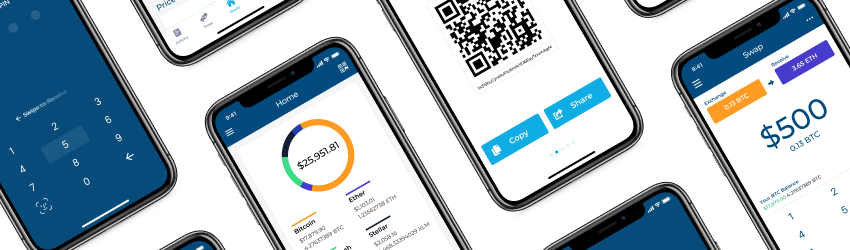

# Blockchain Wallet for iOS




# Building

## Install Xcode

After installing Xcode, open it to begin the Command Line Tools installation. After finished, make sure that a valid CL Tool version is selected in `Xcode > Preferences > Locations > Command Line Tools`.


## Install `homebrew`

https://brew.sh/

## Install Git submodules

    $ git submodule update --init

## Install JS Dependencies

Install a node version manager such as [nvm](https://github.com/creationix/nvm) or [n](https://github.com/tj/n).

    # Install Yarn dependency
    $ brew install yarn

    # Install/Use node v7.9.0
    $ npm install -g n
    $ n v7.9.0

    # Use npm 5.6.0
    $ npm install -g npm@5.6.0

    # Checkout ios branch from Submodules/My-Wallet-V3
    $ cd Submodules/My-Wallet-V3
    $ git checkout ios
    $ cd ../..


    # Install and build js files
    $ sh scripts/install-js.sh && sh scripts/build-js.sh

## Prepare OpenSSL

    $ cd ./Submodules/OpenSSL-for-iPhone
    $ ./build-libssl.sh

## Install LibWallySwift build dependencies

    $ make install

## Install Ruby dependencies

Install a Ruby version manager such as [rbenv](https://github.com/rbenv/rbenv).

    $ brew install rbenv
    $ rbenv init

Install a recent ruby version:

    $ rbenv install -l
    2.6.3
    ...
    $ rbenv install 2.6.3
    $ rbenv rehash

Then make that version either the `local` or `global` version, e.g.:

    $ rbenv global 2.6.3 

Then the project ruby dependencies (`cocoapods`, `fastlane`, etc.):

    $ bundle install

## Install Cocoapods Dependencies

    $ bundle exec pod install

## Bootstrap Carthage Dependencies

    $ carthage bootstrap

## Add production Config file

    #create a directory named Config in the root
    $ mkdir Config

    #create the config file
    $ vi Production.xcconfig

    #write the following in Production.xcconfig

    #include "../Pods/Target Support Files/Pods-Blockchain/Pods-Blockchain.debug production.xcconfig"

    APP_NAME = Blockchain

    APP_ICON = AppIcon

    API_URL = api.blockchain.info

    WALLET_SERVER = blockchain.info

    WEBSOCKET_SERVER = ws.blockchain.info/inv

    WEBSOCKET_SERVER_BCH = ws.blockchain.info/bch/inv

    WEBSOCKET_SERVER_ETH = ws.blockchain.info/eth/inv

    BUY_WEBVIEW_URL = blockchain.info/wallet/#/intermediate

    LOCAL_CERTIFICATE_FILE = blockchain

    FABRIC_API_KEY = <API_KEY>

    FABRIC_SECRET_KEY = <SECRET_KEY>

    GCC_PREPROCESSOR_DEFINITIONS = DEBUG=1 COCOAPODS=1

    OTHER_SWIFT_FLAGS = -DDEBUG

    RETAIL_CORE_URL = api.blockchain.info/nabu-gateway

    RETAIL_CORE_SOCKET_URL = ws.blockchain.info/nabu-gateway/markets/quotes

## Add Firebase Config Files

Create directories `./Blockchain/Firebase/Dev`, `./Blockchain/Firebase/Staging`, and `./Blockchain/Firebase/Prod`.
Open `wallet-ios-credentials` repository on `firebase` branch and copy each environment-specific GoogleService-Info.plist into its respective directory you just created.

## Open the project in Xcode

    $ open Blockchain.xcworkspace

## Build the project

    cmd-r

# Contributing

If you would like to contribute code to the Blockchain iOS app, you can do so by forking this repository, making the changes on your fork, and sending a pull request back to this repository.

When submitting a pull request, please make sure that your code compiles correctly and all tests in the `BlockchainTests` target passes. Be as detailed as possible in the pull request’s summary by describing the problem you solved and your proposed solution.

Additionally, for your change to be included in the subsequent release’s change log, make sure that your pull request’s title and commit message is prefixed using one of the changelog types.

The pull request and commit message format should be:

```
<changelog type>(<component>): <brief description>
```

For example:

```
fix(Create Wallet): Fix email validation
```

For a full list of supported types, see [.changelogrc](https://github.com/blockchain/My-Wallet-V3-iOS/blob/dev/.changelogrc#L6...L69).

# License

Source Code License: LGPL v3

Artwork & images remain Copyright Blockchain Luxembourg S.A.R.L

# Security

Security issues can be reported to us in the following venues:
* Email: security@blockchain.info
* Bug Bounty: https://hackerone.com/blockchain
